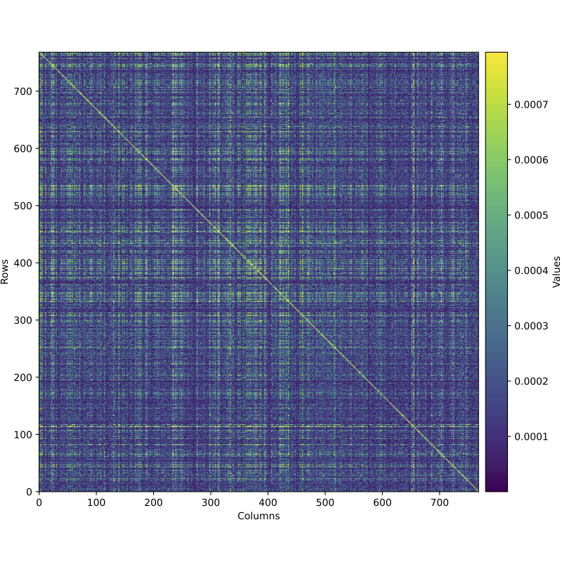
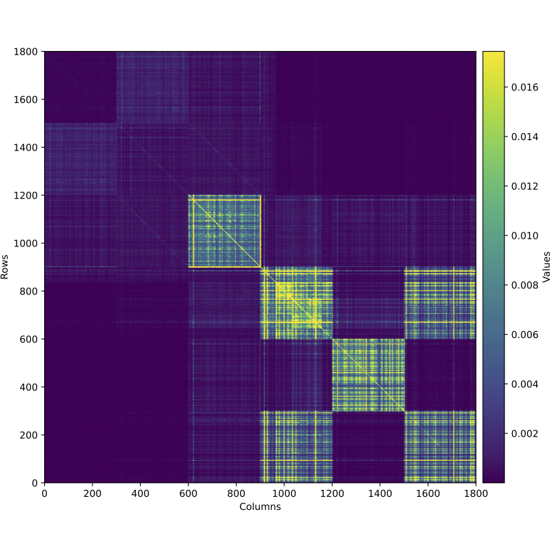
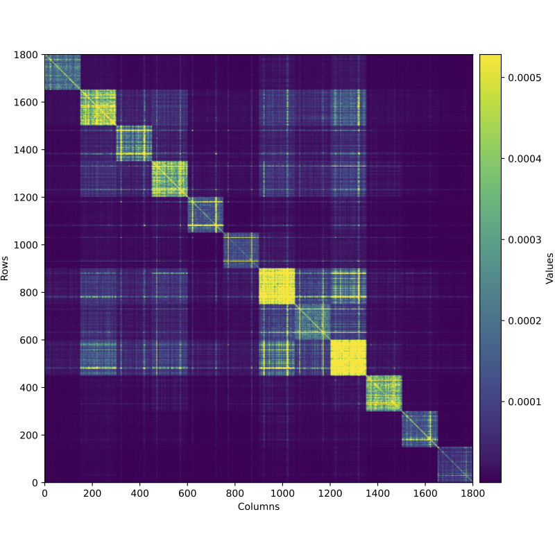
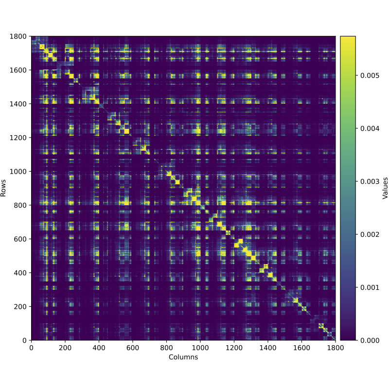
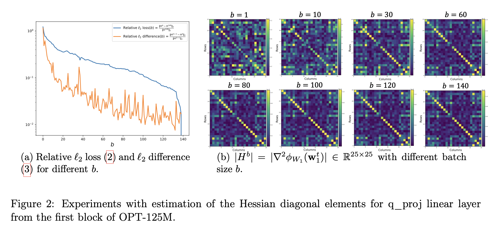
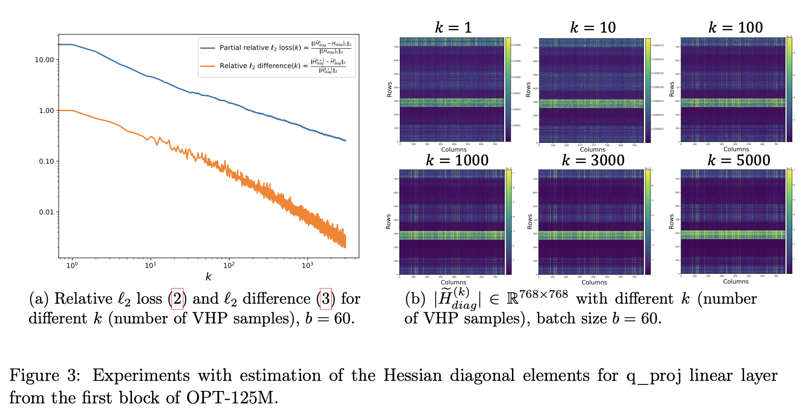

# Hessian of Perplexity for Large Language Models by PyTorch autograd

<p align="center">
  
  
  
</p>

<p align="center">
  <b>Open-source tool to compute the Hessian of the Perplexity function for Large Language Models (LLMs) using PyTorch autograd</b><br>
  <a href="https://arxiv.org/abs/2504.04520"><b>Technical Report on arXiv</b></a>
</p>

---

## 📖 Overview
This repository provides an accurate and efficient implementation for computing the **Hessian of the Perplexity** function in LLMs such as OPT-125M using PyTorch's native autograd engine. Results include full Hessian matrices and their diagonals across different layers and configurations.

## 📚 Citation
If you find our work helpful, please cite us:
```bibtex
@article{ilin2025hessian,
  title={Hessian of Perplexity for Large Language Models by PyTorch autograd (Open Source)},
  author={Ilin, Ivan},
  journal={arXiv preprint arXiv:2504.04520},
  year={2025}
}
```

## ✅ Model Compatibility

This repository is **compatible** with:

- 🧠 [**OPT models**](https://huggingface.co/models?search=facebook/opt) (e.g. `facebook/opt-125m`)
- 🐑 [**LLaMA 2/3/4 models**](https://huggingface.co/models?search=llama) (e.g. `meta-llama/Llama-3.2-1B`)
- 🐣 [**TinyLlama**](https://huggingface.co/TinyLlama) (e.g. `TinyLlama/TinyLlama-1.1B-Chat-v1.0`)

These models are supported via the Hugging Face Transformers interface.

---

## 📊 Results
### 📌 Full Hessian (Heatmaps for different subsets of parameters)
<p>
  
  
</p>

<p>
  <i>Left: </i>Hessian for $Q_{proj} \in \mathbb{R}^{768 \times 768}$ from block 0 — first 768 params.<br>
  <i>Right: </i>Hessian for all 6 linear layers in block 0 — 300 params each.
</p>

<p>
  
  
</p>

<p>
  <i>Left: </i>Hessian for q_proj across 12 blocks — 150 params each.<br>
  <i>Right: </i>Hessian for all layers in 12 blocks — 25 params each × 6 layers/block.
</p>

### 🔽 Download PyTorch Tensors
Saved as PyTorch tensors:
* [hessian_q_proj_t_768.pt](https://github.com/vectozavr/llm-hessian/blob/main/data/hessian_q_proj_t_768.pt)
* [hessian_q_proj_all_blocks_t_150.pt](https://github.com/vectozavr/llm-hessian/blob/main/data/hessian_q_proj_all_blocks_t_150.pt)
* [hessian_all_layers_first_block_t_300.pt](https://github.com/vectozavr/llm-hessian/blob/main/data/hessian_all_layers_first_block_t_300.pt)
* [hessian_all_layers_all_blocks_t_25.pt](https://github.com/vectozavr/llm-hessian/blob/main/data/hessian_all_layers_all_blocks_t_25.pt)
* [hessian_diag_q_proj_vhp_samples_5000.pt](https://github.com/vectozavr/llm-hessian/blob/main/data/diag_hessian/hessian_diag_q_proj_vhp_samples_5000.pt)


### 🔶 Influence of Batch Size


Experiments with varying batch size $b \in \\{1, ..., 140\\}$.

### ⭐ Diagonals of the Hessian (entire linear layer)


Varying number of VHP samples $k \in \\{1, ..., 3000\\}$ for diagonal estimation.

---

## ⚙️ Setup
- Python version: [3.12.4](https://www.python.org/downloads/release/python-3124/) 🐍
```bash
pip install -r requirements.txt
```

📦 [Click here for full Python 3.12.4 installation guide](PYTHON_INSTALL.md)

---

## 🚀 Parameters
| Argument           | Description                                          |
|--------------------|------------------------------------------------------|
| `--model`          | Hugging Face model identifier.                       |
| `--layer_name`     | Name of the linear layer to evaluate.                |
| `--t`              | Number of parameters to consider per layer.          |
| `--block_index`    | Index of a single block (used in some scripts).      |
| `--num_blocks`     | Number of blocks to include.                         |
| `--num_layers`     | Number of linear layers per block.                   |
| `--b`              | Total number of samples for perplexity.              |
| `--vhp_samples`    | VHP samples for Hessian diagonal estimation.         |
| `--model_input_bs` | Number of samples per batch.                         |
| `--seqlen`         | The sequence length for the model. 2048 by default.  |
| `--cache_dir`      | Where to load/store weights. Default: `llm_weights`. |
| `--seed`           | Random seed.                                         |

> 💡 **Tips:**
> - Use larger `--model_input_bs` or `--seqlen` on GPUs with more memory to speed up runtime.
> - Higher `--b` $\cdot$ `--seqlen` and `--vhp_samples` give more accurate results, but increase compute time.

---

## 🔬 Running your experiments

> [!NOTE]  
> Please note that after running any scripts, a `.pt` Hessian tensor and a `.pdf` heatmap of the Hessian will be saved in the `/data` folder.

### 🔹 Single Layer from One Block
```bash
python single_layer_single_block.py \
    --model meta-llama/Llama-3.2-1B \
    --layer_name self_attn.q_proj \
    --block_index 0 \
    --t 5 \
    --b 30 \
    --model_input_bs 1 \
    --seed 0 \
    --cache_dir llm_weights
```

### 🔹 Single Layer from Several Blocks
```bash
python single_layer_several_blocks.py \
    --model meta-llama/Llama-3.2-1B \
    --layer_name self_attn.q_proj \
    --t 5 \
    --num_blocks 3 \
    --b 30 \
    --model_input_bs 1 \
    --seed 0 \
    --cache_dir llm_weights
```

### 🔹 Several Layers from Several Blocks
```bash
python several_layers_several_blocks.py \
    --model meta-llama/Llama-3.2-1B \
    --t 5 \
    --num_layers 3 \
    --num_blocks 3 \
    --b 30 \
    --model_input_bs 1 \
    --seed 0 \
    --cache_dir llm_weights
```

### 🔹 Compute only Diagonal Elements (full layer)
```bash
python hessian_diag_single_layer.py \
    --model meta-llama/Llama-3.2-1B \
    --layer_name self_attn.q_proj \
    --vhp_samples 10 \
    --block_index 0 \
    --b 30 \
    --model_input_bs 1 \
    --seed 0 \
    --cache_dir llm_weights
```

> [!WARNING]  
> Please try `facebook/opt-125m` for `--model` parameter instead of larger Llama models if your computations are too slow, or you do not have enough GPU memory.

> [!NOTE]  
> If you want to consider your custom subset of parameters (for example a random subset or $t$ parameters), you need to change the `custom_forward(self, inpt)` method, where you define how the desired subset of parameters should form a full weight metrix.


---

## 📄 License
MIT License. See [LICENSE](LICENSE) for details.

---

## 💬 Join the Discussion
We welcome issues, feature requests, and contributions! Feel free to open an [issue](https://github.com/vectozavr/llm-hessian/issues) or a [pull request](https://github.com/vectozavr/llm-hessian/pulls).

